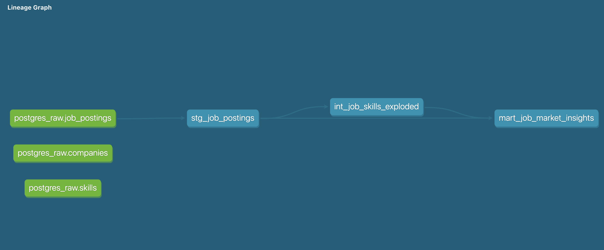

# Job Market Data Pipeline (500k Scale)
A robust, end-to-end ELT pipeline that ingests, cleans, and transforms half a million job postings to uncover high-demand skills and salary benchmarks.

The Lesson Learnt:   
Environment Isolation  
Throughout this project, I learned the hard way that "it works on my machine" is a myth unless you isolate your environment. I encountered multiple ModuleNotFoundError and version mismatch issues by relying on system-level Python.

# My Golden Rules for Stability:  

Isolate: Always use pyenv to pin your Python version (e.g., 3.11.9) and venv to create a hermetic container for your dependencies.

** Namespace Awareness:**
Be extremely careful with package names. For example, installing the wrong jobspy (Redis coordinator) instead of python-jobspy (the scraper) will break your build. Always verify your pip list.

**Absolute Paths: When orchestrating scripts, use the absolute path to your environment's Python binary (./venv/bin/python). It’s the only way to be 100% sure the script is running in the correct sandbox.

**The Problem  
Modern job market data is messy, unstructured, and high-volume. Analyzing 500,000+ records in a standard BI tool without a structured data warehouse leads to:

**Performance Bottlenecks:   Local machines crashing due to memory (RAM) exhaustion.

**Data Quality Issues:   "Dirty" strings and comma-separated "skills" that cannot be aggregated.

Lack of Lineage: No clear path from raw data to final business metrics.

# The Approach:   
**Medallion Architecture  
I implemented a Medallion Architecture to ensure data reliability and scalability:

**Bronze (Raw):   Ingested 500,000 rows into PostgreSQL using a chunking strategy to maintain a low memory footprint.

**Silver (Staging):   Used dbt to cast data types, trim strings, and create derived flags.

**Intermediate:   Solved the "Skills" problem by unnesting comma-separated strings into a normalized, long-format table using UNNEST.

**Gold (Marts):   Aggregated metrics into a final "Insights" table, ranking skills by demand and salary.

**Graph: 

**Tech Stack
Language: Python 3.11.9

Database: PostgreSQL

Transformation: dbt (Data Build Tool)

Key Libraries: python-jobspy, pandas, sqlalchemy, psycopg2-binary, dbt-

# Setup & Execution  
**Configure Environment:  
brew install pyenv  
pyenv install 3.11.9  
pyenv local 3.11.9

**Initialize:  
python -m venv venv  
source venv/bin/activate  
pip install -r requirements.txt

**Run Pipeline:
./orchestration/run_pipeline.sh

**Key Engineering Features   
**Memory-Efficient Ingestion:   Used chunksize processing to handle massive CSVs.

**Idempotent Pipelines:   Designed scripts to be "run-ready" at any time.

**Version Control:   Managed dependencies via pip freeze > requirements.txt to ensure cross-environment consistency.